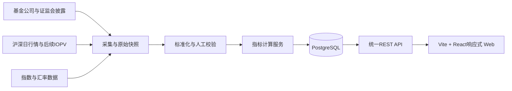

# 指数基金比较工具需求规划

> 项目暂定名：指数基金比较工具（Index Fund Comparator）  
> 当前阶段：个人自用 EOD 版规划  
> 规划日期：2026-08-10  
> 最近更新：2026-08-12  
> 首版平台：响应式 Web，同时适配 PC 和移动端浏览器  
> 后续平台：微信小程序（待数据授权、主体资质和类目可行性确认后再评估）  
> 首批指数：标普500、纳斯达克100、中证500

## 目录

- [一、项目定位](#一项目定位)
  - [1. 产品形态](#1-产品形态)
  - [2. 产品边界](#2-产品边界)
  - [3. 首版EOD口径](#3-首版eod口径)
- [二、比较字段需求](#二比较字段需求)
  - [1. 场内基金](#1-场内基金)
  - [2. 场外基金](#2-场外基金)
- [三、指数和产品分类](#三指数和产品分类)
- [四、合规与法律分析](#四合规与法律分析)
  - [1. 个人自用阶段](#1-个人自用阶段)
  - [2. 公开网站或小程序阶段](#2-公开网站或小程序阶段)
  - [3. 微信小程序特殊要求](#3-微信小程序特殊要求)
  - [4. 广告、备案和隐私](#4-广告备案和隐私)
- [五、数据获取方案](#五数据获取方案)
  - [1. 权威来源](#1-权威来源)
  - [2. 数据授权风险](#2-数据授权风险)
  - [3. 采集系统设计](#3-采集系统设计)
- [六、指标口径](#六指标口径)
  - [1. 收益率](#1-收益率)
  - [2. 跟踪误差](#2-跟踪误差)
  - [3. 估算偏离与盘中溢价](#3-估算偏离与盘中溢价)
- [七、技术架构](#七技术架构)
  - [推荐技术选型](#推荐技术选型)
  - [核心接口](#核心接口)
  - [核心数据库表](#核心数据库表)
- [八、分阶段实施计划](#八分阶段实施计划)
  - [阶段0：口径和样本验证](#阶段0口径和样本验证)
  - [阶段1：个人自用EOD版](#阶段1个人自用eod版)
  - [阶段2：盘中和自动化](#阶段2盘中和自动化)
  - [阶段3：公开运营准备](#阶段3公开运营准备)
- [九、阶段性结论](#九阶段性结论)
- [十、主要参考资料](#十主要参考资料)

## 一、项目定位

建立一个按“同一基准指数”归类的基金比较工具，展示不同基金公司产品的客观数据，帮助使用者了解产品差异。

工具首期只做基于日终数据的信息查询和并排比较，不提供基金交易、个性化投资建议或自动投资组合服务。

### 1. 产品形态

- 用户选择一个指数，再选择若干基金进行并排比较。
- 首版使用一套响应式 Web 界面，在 PC 和移动端浏览器中提供一致功能。
- 场内基金和场外基金使用不同字段模板。
- 展示每项数据的统计日期、来源和数据更新时间。
- 默认按基金代码或基金公司排序，不默认生成“最佳基金”或综合排名。
- 对缺失、过期、估算和跨市场时间错位的数据明确标注。

### 2. 产品边界

首期不包含：

- 开户、申购、赎回、交易或代客下单；
- 基于用户资产、年龄、风险偏好的个性化推荐；
- “买入/卖出”“抄底”“套利机会”等交易信号；
- 星级、综合评分、最佳产品榜单；
- 基金公司或销售平台的付费导流；
- LOF 基金的采集、展示和比较。

### 3. 首版EOD口径

EOD（End of Day）指日终数据。首版不追求盘中实时更新，而是在交易日结束、当日可用数据公布后定时更新。

首版EOD数据包括：

- 场内基金的日收盘价和成交额；
- 基金每日净值和复权净值；
- 基金费率、规模和基本信息；
- 日频基准指数和必要的汇率数据；
- 基于日频数据计算的历史收益、跟踪差和跟踪误差。

首版不包括实时交易价格、分钟级行情、盘中IOPV和实时溢价率。境内基金净值通常在晚间公布，QDII净值可能延迟一个或多个交易日，因此页面必须分别显示收盘价日期、净值日期和系统更新时间。

## 二、比较字段需求

### 1. 场内基金

- 基金代码
- 基金名称
- 基金公司
- 产品结构：ETF
- 投资范围：境内、QDII、港股通等
- 精确跟踪基准
- 上市交易所
- 管理费
- 托管费
- 运作费率（管理费+托管费）
- 最新日收盘价及交易日期
- 最新可用净值及净值日期
- 收盘价相对最新可用净值的估算偏离（可选）
- 净值收益率：1日、3日、5日、1周、1月、3月、年初至今、1年
- 市场价格收益率：同样的周期
- 跟踪误差
- 基金规模

首版EOD估算偏离定义：

```text
估算偏离 = 当日收盘价 / 最新可用单位净值 - 1
```

该指标不是盘中实时溢价率。当收盘价与净值日期不一致时，必须显示两个日期并标记为“估算”；QDII等跨市场产品默认不把该数值解读为可申赎价值的实时偏离。盘中IOPV和实时溢价率留待后续阶段接入授权行情后实现。

### 2. 场外基金

- 基金代码
- 基金名称
- 基金公司
- 产品结构：普通开放式指数基金、ETF联接基金
- 投资范围：境内、QDII、港股通等
- 精确跟踪基准
- 基金份额类别：A、C等
- 基金货币类别：人民币、美元等
- 管理费
- 托管费
- 运作费率（管理费+托管费）
- 销售服务费（单独列出）
- 净值收益率：1日、3日、5日、1周、1月、3月、年初至今、1年
- 跟踪误差
- 基金规模
- 基金公司直销限额
- 指定代销平台限额
- 限额对应的渠道、投资者类型和业务类型

“总费用”不建议作为最终字段名称。管理费和托管费不包含申购费、赎回费、销售服务费、交易成本、汇率成本等，正式产品应分别展示。

## 三、指数和产品分类

不能只按基金名称中是否出现指数名称进行归类，应建立标准化指数主数据：

- 标普500：区分价格指数、净收益指数、全收益指数以及人民币折算口径。
- 纳斯达克100：区分不同总收益口径、汇率折算方式和业绩比较基准。
- 中证500：区分中证500价格指数、全收益指数及基金合同中的具体基准。

产品至少需要记录以下相互独立的分类维度，而不是使用一组互斥的平级分类：

| 分类维度 | 可选值示例 | 说明 |
|---|---|---|
| 产品结构 | ETF、普通开放式指数基金、ETF联接基金 | 描述基金的法律及运作结构；本项目当前范围不支持 LOF |
| 交易方式 | 仅场内、仅场外 | 用于区分交易所买卖的ETF和通过场外渠道申赎的基金份额 |
| 投资范围 | 境内、QDII、港股通等 | QDII是投资范围属性，可以同时是ETF、ETF联接基金或普通开放式基金 |
| 跟踪方式 | 被动指数、指数增强 | 指数增强产品应与纯被动产品分组比较 |
| 份额类别 | A、C、I、人民币、美元现汇、美元现钞等 | 同一基金产品可以有多个费率和渠道不同的份额类别 |
| 上市信息 | 上交所、深交所、未上市 | 上市代码和交易所信息应独立保存 |
| 精确跟踪基准 | 价格指数、净收益指数、全收益指数及不同货币折算版本 | 只有精确基准一致时，跟踪误差才具有直接可比性 |

这些维度存在交叉关系：ETF联接基金属于场外基金；QDII基金可以采用ETF、ETF联接基金或普通开放式结构；A类、C类属于同一基金产品下的份额类别，而不是独立产品类型。

本项目当前范围明确不采集、展示或比较 LOF 基金。除了缩小产品范围、使场内 ETF 和场外基金的数据口径更清晰以外，LOF 正在征求意见的终止上市安排也会显著影响相关产品的存续状态。

2026年8月7日，沪深交易所就完善 LOF 相关安排公开征求意见。以上交所征求意见稿为例，拟明确：

- QDII LOF 应当最晚于2027年12月31日终止上市；
- LOF 连续60个交易日每日场内资产净值均低于1000万元的，应当终止上市；
- 终止上市后可根据规定转型为场外基金，或依法清盘退市。

上述安排在本文更新时仍为征求意见稿，不表示所有 LOF 已经或将在同一时点终止上市。但标普500和纳斯达克100相关 QDII LOF 将直接受到拟议安排影响，因此本项目不将 LOF 纳入当前或后续规划范围。

实际展示时应按以下同类比较组组织：

1. 同一精确指数的场内ETF；
2. 同一精确指数的普通场外指数基金；
3. 跟踪同一ETF或同一精确指数的ETF联接基金；
4. 同一基金产品的不同份额类别。

数据模型上，基金主体、份额类别和ETF上市证券应分别保存为`fund_product`、`fund_share_class`和`fund_listing`。`fund_listing`仅用于保存ETF的交易所、场内代码和行情等上市信息。界面可将QDII等属性显示为标签，但不应把它当作ETF、ETF联接基金或普通开放式基金这类产品结构。

## 四、合规与法律分析

### 1. 个人自用阶段

如果工具只在本地、内网、个人服务器或微信开发版/体验版中使用，不公开传播、不收费、不接广告、不代交易、不提供个性化建议，通常属于个人投资研究工具，非法荐股风险较低。

仍然需要遵守数据来源网站的服务条款、访问频率限制、robots规则和数据版权要求。

### 2. 公开网站或小程序阶段

《公开募集证券投资基金销售机构监督管理办法》将宣传推介基金、办理基金份额发售、申购、赎回等纳入基金销售，未经注册不得从事基金销售业务。因此公开版应避免交易账户、购买按钮、开户入口和佣金导流。

《证券投资基金评价业务管理暂行办法》规定，评级、评奖、单一指标排名均属于基金评价业务，具有点击排序功能的网站或咨询系统也可能被纳入。公开从事基金评价，需要加入中国证券投资基金业协会并向证监会备案，并满足分类数量、评价周期、更新频率等要求。

公开版应采用以下设计：

- 用户主动选择基金后进行并排比较；
- 默认按代码或基金公司排序；
- 不提供短期收益、跟踪误差的点击排名；
- 不使用“最佳、推荐、值得买、首选”等文案；
- 对“评分、评级、榜单”功能暂不开发；
- 展示计算方法、数据来源、数据时间和风险提示。

如果未来提供基金组合建议、基金申赎建议、自动调仓或基于用户情况的个性化建议，应与具备相应资质的基金投顾机构合作，并重新进行法律审查。2023年证监会曾就《公开募集证券投资基金投资顾问业务管理规定》公开征求意见，相关规则状态和后续文件应在上线前重新核对。

### 3. 微信小程序特殊要求

微信开放类目中，“金融业—公募基金”和股票信息服务平台通常要求相应金融资质、行情授权或合作材料。当前个人主体开放类目不包含金融业，因此个人主体公开发布该类小程序存在审核不确定性。

正式公开时建议：

- 使用企业主体；
- 先向微信确认适用类目和资质材料；
- 取得沪深行情展示或使用许可；
- 不在小程序内提供交易或购买导流；
- 完成小程序备案、隐私政策和合法域名配置。

### 4. 广告、备案和隐私

如果接受基金公司、券商、销售平台或数据商赞助，需识别广告关系并遵守《广告法》。投资回报预期类广告不得承诺保本、无风险或保证收益，也不得用专家或受益人名义作推荐证明。

网站公开运营还要根据经营性质办理ICP备案或相关许可，并遵守《个人信息保护法》《数据安全法》《网络安全法》。首期可以不登录、不收集手机号和身份证等个人信息，降低合规成本。

免责声明不能替代资质，也不能掩盖实质性的推荐、销售或评价行为。

## 五、数据获取方案

### 1. 权威来源

| 数据 | 主要来源 | 更新特征 |
|---|---|---|
| 基金代码、名称、类型 | 证监会统一披露平台、沪深交易所、基金公司官网 | 相对稳定 |
| 招募说明书、费率 | 证监会基金信息披露平台、基金公司公告 | 发生变更时更新 |
| 每日净值 | 基金公司净值公告、基金披露平台 | 场外通常每日，QDII可能延迟 |
| 基金规模 | 季报、半年报、年报 | 低频，必须显示统计日期 |
| 场内交易价格 | 沪深交易所或持牌数据商 | 首版仅日收盘数据；后续再评估盘中数据 |
| IOPV | 交易所、中证指数或基金公告 | 首版不接入；后续在授权明确后接入 |
| 标普500、纳斯达克100指数 | S&P DJI、Nasdaq或商业数据商 | 需确认历史和实时许可 |
| 中证500指数 | 中证指数有限公司或持牌数据商 | 需确认展示和衍生计算许可 |
| 汇率 | 央行、外汇市场或商业数据商 | QDII计算需要时点对齐 |
| 申购限额 | 基金公司公告、直销平台、指定代销平台 | 变化频繁，需保存生效时间 |

### 2. 数据授权风险

个人自用可以先采用官方公开披露、人工录入和低频抓取做验证；公开产品不能默认使用东方财富、同花顺、雪球等网页内部接口。

实时行情和境外指数数据通常是项目成本和法律风险最高的部分，需要确认：

- 是否允许商业使用；
- 是否允许在网站和小程序展示；
- 是否允许缓存历史数据；
- 是否允许计算并公开展示衍生指标；
- 是否限制访问人数、终端数或调用频率。

### 3. 采集系统设计

按“来源适配器”设计，不要把所有基金公司写死在一个爬虫中。每个适配器负责：

1. 获取原始页面、API响应或PDF；
2. 保存原始快照和抓取时间；
3. 解析为统一字段；
4. 做数值、日期和代码校验；
5. 对异常数据进入人工复核队列。

费率、规模、限额必须采用带生效时间的历史记录，不能简单覆盖旧值。

## 六、指标口径

### 1. 收益率

建议首期使用：1日、3日、5日、1周、1月、年初至今、1年。每项必须显示起止日期。

场内基金同时展示：

- NAV收益：反映基金资产净值表现；
- 市场价格收益：反映投资者在交易所买卖的表现。

场外基金使用复权净值，处理分红、拆分和份额类别差异。

### 2. 跟踪误差

建议定义为每日跟踪差的年化标准差：

```text
tracking_difference_t = fund_return_t - benchmark_return_t
tracking_error = std(tracking_difference) × sqrt(年化交易日数)
```

建议提供3个月、6个月、1年窗口，并同时保留基金合同业绩基准口径和统一指数口径。

### 3. 估算偏离与盘中溢价

首版只可选展示收盘价相对最新可用净值的估算偏离，并同时展示收盘价日期和净值日期。不将该值命名为“实时溢价率”。

QDII产品必须显示交易价格时间、净值时间和数据更新时间。若境外市场交易日历、指数或汇率时点未同步，估算偏离可能不能代表真实可申赎价值。

后续阶段只有在取得授权的盘中交易价格和同时点IOPV后，才计算并展示盘中参考溢价率。

## 七、技术架构



### 推荐技术选型

- 首版响应式 Web：Vite、React、TypeScript；构建产物为静态文件，由浏览器直接调用 FastAPI；
- 共享代码：基金领域模型、API客户端、指标格式化、设计变量；
- 后端：FastAPI；
- 数据库：PostgreSQL；
- 缓存：Redis，公开版或盘中行情阶段再加入；
- 文件存储：保存公告PDF、原始JSON和数据源快照；
- 任务调度：Cron/APScheduler起步，规模扩大后使用Celery等任务队列；
- 首版部署：支持响应式 Web 的服务器、HTTPS和备案域名；小程序合法域名留待后续阶段。

### 核心接口

```text
GET /indices
GET /indices/{index_id}/funds
GET /comparisons?fund_codes=...
GET /funds/{fund_code}/nav
GET /funds/{fund_code}/metrics
GET /funds/{fund_code}/limits
GET /sources/{source_id}
```

### 核心数据库表

```text
index_definition
fund_product
fund_share_class
fund_listing
fee_history
nav_daily
market_quote
benchmark_daily
fund_scale
sales_limit_history
calculated_metric
source_document
```

所有动态字段应保存：

```text
source_url、source_time、effective_from、collected_at、quality_status
```

前端对过期数据、估算数据和暂不可比数据进行显式提示。

## 八、分阶段实施计划

### 阶段0：口径和样本验证

- 确定三个指数的标准化基准；
- 建立首批基金清单；
- 确定产品结构、交易方式、投资范围、跟踪方式、份额类别和精确基准等多维分类规则；
- 手工采集10—20只基金，验证所有计算口径。

### 阶段1：个人自用EOD版

- 实现同时适配 PC 和移动端浏览器的响应式 Web 页面；
- 接入日收盘价、每日净值、费率、规模和历史收益；
- 展示收盘价日期、净值日期、来源和系统更新时间；
- 使用日频数据计算跟踪差和跟踪误差；
- 手工维护申购限额；
- 暂不做实时行情；
- 暂不做盘中IOPV和实时溢价率；
- 暂不做微信小程序；
- 暂不做公开排名或评分。

### 阶段2：盘中和自动化

- 接入授权行情和IOPV；
- 实现参考溢价率；
- 建立基金公司公告采集和人工复核；
- 自动计算跟踪误差和数据质量状态；
- 增加来源追溯和异常告警。

### 阶段3：公开运营准备

- 完成行情、指数和数据再分发授权；
- 完成法律意见和产品合规审查；
- 如计划开发小程序，确认微信小程序类目、数据授权和企业主体材料；
- 建立数据更正、投诉和历史留痕机制；
- 评估是否需要与基金评价或基金销售机构合作。

## 九、阶段性结论

- 响应式 Web EOD版：可行性高，适合作为唯一首版客户端立即开始。
- 实时溢价版：技术可行，但必须优先解决行情和指数授权。
- 自动采集申购限额：技术上可做，但维护成本高、渠道差异大。
- 公开网站：可以做，但应定位为客观数据查询与用户主动比较工具。
- 个人主体公开微信小程序：存在明显类目和资质风险，不应作为第一上线目标。
- 公开榜单、评分、排序：应视为独立合规项目，不建议在MVP中实现。

## 十、主要参考资料

- [公开募集证券投资基金销售机构监督管理办法](https://www.gov.cn/gongbao/content/2020/content_5554550.htm)
- [证券投资基金评价业务管理暂行办法](https://www.gov.cn/zhengce/2021-12/16/content_5724599.htm)
- [证监会就基金投顾业务管理规定征求意见](http://www.csrc.gov.cn/csrc/c100028/c7413556/content.shtml)
- [证监会公募基金统一信息披露平台](http://eid.csrc.gov.cn/fund/disclose/index.html)
- [上证所行情服务](https://www.sseinfo.com/services/assortment/market/)
- [深市行情信息授权](http://www.szsi.cn/cpfw/fwsq/hq/sq.htm)
- [上交所关于完善上市开放式基金相关安排的征求意见通知](https://www.sse.com.cn/lawandrules/publicadvice/c/c_20260807_10828305.shtml)
- [微信小程序开放服务类目](https://developers.weixin.qq.com/miniprogram/product/material/)
- [中华人民共和国广告法](https://www.gov.cn/guoqing/2021-10/29/content_5647620.htm)
- [S&P DJI数据与指数许可](https://www.spglobal.com/spdji/en/about-us/data-index-licensing/)
- [Nasdaq指数数据](https://www.nasdaq.com/solutions/global-indexes/data)

> 本文是产品和技术规划，不替代律师、合规顾问或数据供应商的正式意见。公开上线前应按届时有效的法律法规、证监会规则、微信平台规则和数据合同重新审核。
